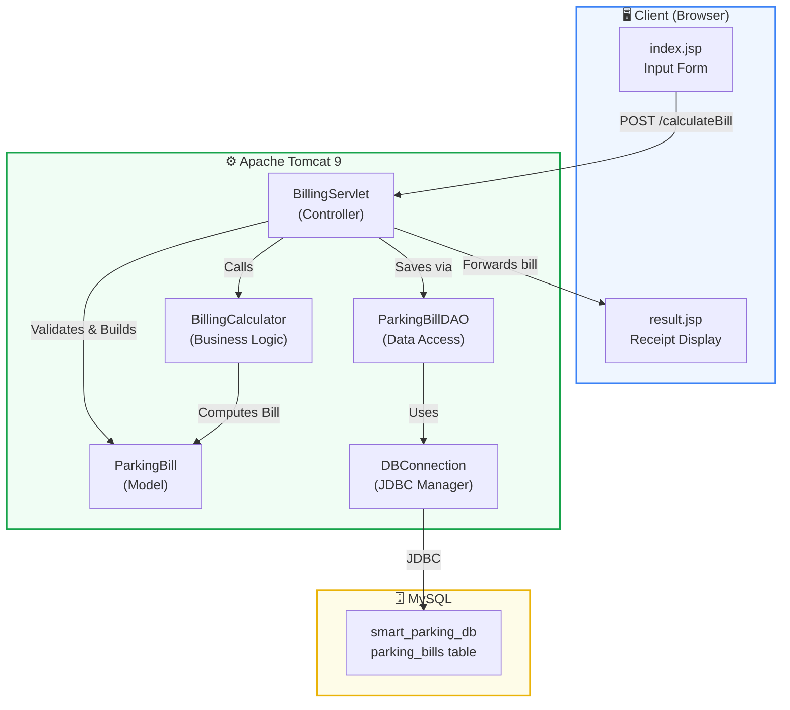
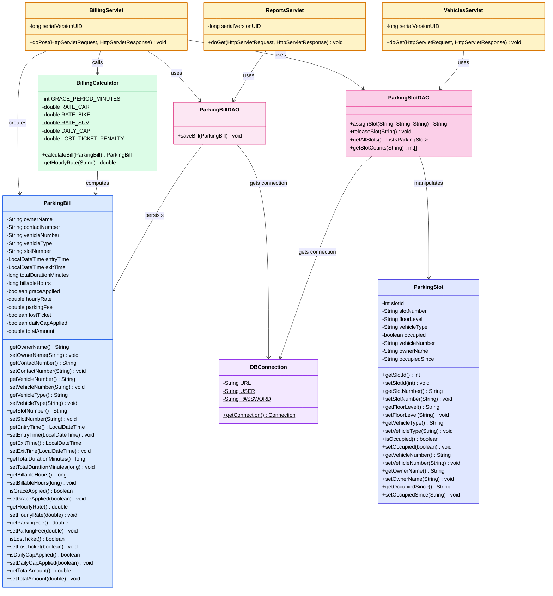
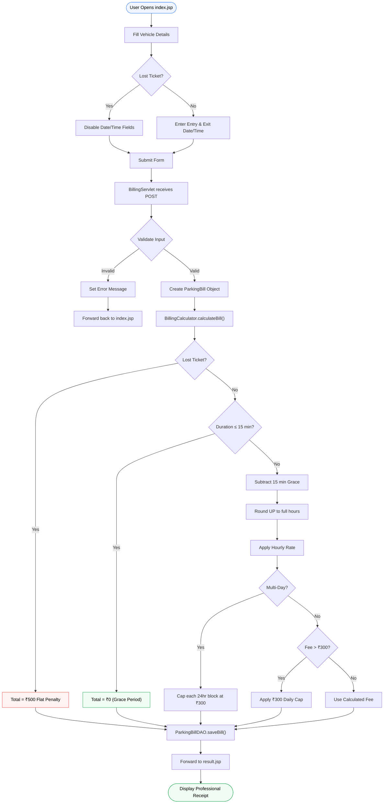
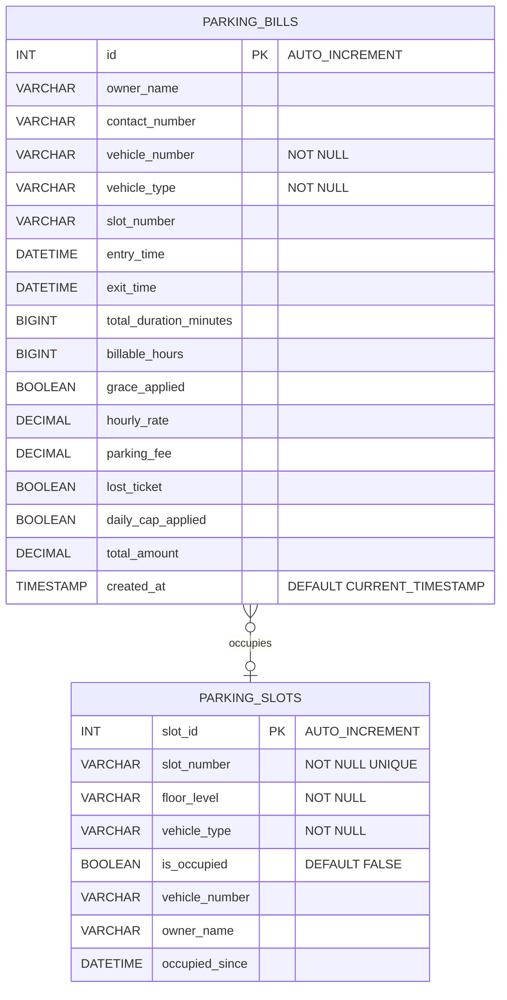

<div align="center">

# 🅿️ SmartParking Billing Engine

### Smart City Parking Management System


A full-stack **Java Servlet + JSP** web application that powers an automated billing engine for a multi-level smart city parking system. It computes parking fees based on duration, vehicle type, grace periods, daily caps, and lost ticket penalties — with persistent storage in MySQL.

---

</div>

## ✨ Features

| Feature | Description |
|:--------|:------------|
| ⏱️ **Grace Period** | First 15 minutes of parking are completely free |
| 🔄 **Smart Rounding** | Partial hours are always rounded UP to the next full hour |
| 🚗 **Vehicle-based Rates** | Car: ₹40/hr · Bike: ₹20/hr · SUV: ₹60/hr |
| 📅 **Daily Cap** | Maximum charge of ₹300 per completed 24-hour block |
| 🎫 **Lost Ticket** | Flat ₹500 penalty (duration is ignored) |
| 📊 **Multi-Day Stay** | Automatic per-day capping for extended parking |
| 🧾 **Professional Receipt** | Detailed breakdown with Print functionality |
| 💾 **Database Persistence** | All bills saved to MySQL via JDBC |
| ✅ **Input Validation** | Server-side and client-side validation |

---

## 🏗️ System Architecture



---

## 📐 Class Diagram



---

## 🔄 Application Flow



---

## 🗄️ Database Schema



---

## 📂 Project Structure

```
SmartParking/
│
├── 📄 pom.xml                             # Maven config (Java 21, Servlet API, MySQL Connector)
├── 📄 database.sql                        # MySQL schema setup script
├── 📄 README.md
├── 📄 .gitignore
│
├── 📁 src/main/java/
│   ├── 📁 model/
│   │   └── 📄 ParkingBill.java            # POJO — encapsulates all billing data
│   ├── 📁 util/
│   │   ├── 📄 BillingCalculator.java      # Core business logic engine
│   │   └── 📄 DBConnection.java           # JDBC connection manager
│   ├── 📁 dao/
│   │   └── 📄 ParkingBillDAO.java         # Data Access Object for MySQL persistence
│   └── 📁 servlet/
│       └── 📄 BillingServlet.java         # Controller — handles form POST requests
│
└── 📁 WebContent/
    ├── 📄 index.jsp                        # Landing page with billing form
    ├── 📄 result.jsp                       # Professional receipt display
    ├── 📁 css/
    │   └── 📄 style.css                   # Custom Smart City theme
    └── 📁 WEB-INF/
        └── 📄 web.xml                     # Deployment descriptor
```

---

## 💰 Billing Rules Reference

```
┌─────────────────────────────────────────────────────────┐
│                   BILLING LOGIC                         │
├─────────────────────────────────────────────────────────┤
│                                                         │
│  Lost Ticket?                                           │
│  ├── YES → Charge flat ₹500. Ignore duration.           │
│  └── NO  → Continue ↓                                   │
│                                                         │
│  Duration ≤ 15 minutes?                                 │
│  ├── YES → Charge ₹0. Grace period applied.             │
│  └── NO  → Continue ↓                                   │
│                                                         │
│  Step 1: Subtract 15 min grace period                   │
│  Step 2: Convert remaining mins → hours (round UP)      │
│          Example: 61 min → 2 hrs, 121 min → 3 hrs       │
│  Step 3: Apply hourly rate                              │
│          Car=₹40  Bike=₹20  SUV=₹60                     │
│  Step 4: Apply daily cap (₹300 per 24hr block)          │
│                                                         │
│  Multi-Day Example (50 hours, Car):                     │
│  ├── 2 × 24hr blocks = 2 × ₹300 = ₹600                 │
│  ├── Remaining 2 hrs  = 2 × ₹40  = ₹80                  │
│  └── Total = ₹680                                       │
│                                                         │
└─────────────────────────────────────────────────────────┘
```

---

## 🛠️ Technology Stack

| Layer | Technology | Purpose |
|:------|:-----------|:--------|
| **Language** | Java 21 | Core application logic |
| **Web Framework** | Java Servlets (javax.servlet 4.0) | HTTP request handling |
| **View Engine** | JavaServer Pages (JSP) | Dynamic HTML rendering |
| **Frontend** | HTML5, CSS3, Bootstrap 5 | Responsive UI with modern design |
| **Icons** | Bootstrap Icons | Professional iconography |
| **Database** | MySQL 8.x | Persistent storage |
| **JDBC Driver** | MySQL Connector/J 8.3 | Java ↔ MySQL communication |
| **Build Tool** | Apache Maven | Dependency and build management |
| **Server** | Apache Tomcat 9 | Servlet container |
| **IDE** | Eclipse Enterprise Edition | Development environment |

---

## 🚀 Getting Started

### Prerequisites

- **Java 21** (JDK)
- **Apache Tomcat 9.x**
- **MySQL 8.x** (running on `localhost:3306`)
- **Eclipse Enterprise Edition** (recommended)
- **Maven 3.x**

### 1️⃣ Clone the Repository

```bash
git clone https://github.com/KL2300030695/SmartParking.git
cd SmartParking
```

### 2️⃣ Setup the Database

Open MySQL Workbench (or any SQL client) and execute:

```sql
SOURCE /path/to/SmartParking/database.sql;
```

This creates the `smart_parking_db` database and `parking_bills` table.

> **Note:** If your MySQL credentials are different from `root` / `root`, update them in `src/main/java/util/DBConnection.java`.

### 3️⃣ Import into Eclipse

1. `File` → `Import` → `Maven` → `Existing Maven Projects`
2. Browse to the cloned `SmartParking` directory
3. Click `Finish`
4. Right-click project → `Maven` → `Update Project` (`Alt + F5`)

### 4️⃣ Configure Tomcat

1. `Window` → `Show View` → `Servers`
2. Click `No servers available. Click this link to create a new server...`
3. Select `Apache Tomcat v9.0` → Browse to your Tomcat directory → `Finish`

### 5️⃣ Run the Application

1. Right-click `SmartParking` → `Run As` → `Run on Server`
2. Select your Tomcat 9 server → `Finish`
3. Application opens at: **`http://localhost:8080/SmartParking/`**

---

## 🧪 Test Scenarios

| # | Scenario | Input | Expected Output |
|:-:|:---------|:------|:----------------|
| 1 | **Grace Period** | Duration = 10 min, Car | Total = ₹0.00 |
| 2 | **Exact Hour** | Duration = 60 min, Car | Total = ₹40.00 (1 hr after grace) |
| 3 | **Round Up** | Duration = 61 min, Car | Total = ₹80.00 (2 hrs after grace) |
| 4 | **Daily Cap** | Duration = 12 hrs, Car | Total = ₹300.00 (capped) |
| 5 | **Multi-Day** | Duration = 50 hrs, Car | Total = ₹680.00 (2×₹300 + 2×₹40) |
| 6 | **Lost Ticket** | Lost Ticket = Yes | Total = ₹500.00 |
| 7 | **Bike Rate** | Duration = 2 hrs, Bike | Total = ₹40.00 (2×₹20) |
| 8 | **SUV Rate** | Duration = 2 hrs, SUV | Total = ₹120.00 (2×₹60) |

---

## 📜 License

This project is built for academic and demonstration purposes as part of a **Smart City Parking Management System**.

---

<div align="center">

**Built with ❤️ using Java Servlets, JSP, and Bootstrap 5**

</div>
